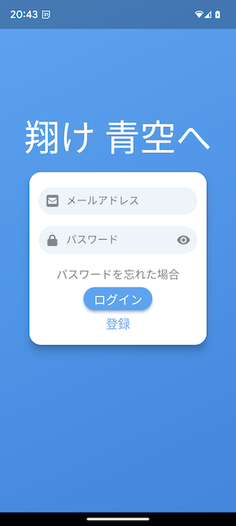

# flutter_bluesky

This plugin provides a client for [bluesky](https://bsky.app/) or other PDS of [atproto](https://github.com/bluesky-social/atproto).

It is **not completed** to invoke all APIs.
I will make it little by little.
It may change by spec change of atproto.

## Getting Started
```
cd flutter_bluesky/example
flutter pub get
flutter run 
```

Enjoy!!
- View the data only: NOT IMPLEMETNED Post, Like, Follow, and so on.
  It mean you should create account with another account.
- Android and iOS: Only I tested. Other, please try and let me know.

---
||||
---
## DB 
The ATProtocol designs that the client must store data in case a PDS the client connectted is crashed.
Actually, I don't understand enough. Please tell me.

### Structure (under construction)
Account Entity is not for atproto but flutter_bluesky to manage session with each provider and the user. 
```
└── tables
    ├── account.dart
    └── app_view
        ├── post.dart
        :
```
